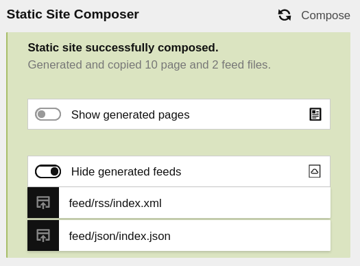

# Kirby 3 Static Site Composer

A Kirby 3 plugin for ~~building~~ composing a static site.

Essentially a wrapper to integrate and trigger suitable community plugins:

1. [Static Site Generator](https://getkirby.com/plugins/d4l-data4life/static-site-generator)
2. [Feed](https://getkirby.com/plugins/bnomei/feed)

**Screenshot of field's initial state in Kirby 3 Panel**


**Screenshot of field with results from successfull run**



## Installation

### Download

Download and copy this repository to `/site/plugins/static-site-composer`.

### Git submodule

```
git submodule add https://github.com/matthiasjg/kirby3-static-site-composer.git site/plugins/static-site-composer
```

### Composer

```sh
composer require matthiasjg/kirby3-static-site-composer
```

## Setup

Instructions on how to configure the plugin, i.e. blueprint setup and config options.

### Blueprint Field

```yml
# site/blueprints/site.yml
fields:
  staticSiteComposer:
    label: Compose
    # help: Click here to compose a static version of the website of pages and feeds.
    # progress: Please wait, composing site...
    # success: Static site successfully composed.
    # error: An error occurred
```

### Config Options

This plugin is confgured with the following options:

```php
# site/config/config.php
return [
  'matthiasjg' => [
    'static_site_composer' => [
      'endpoint'                  => 'compose-static-site', # set to any string like 'compose-static-site' to use the built-in endpoint (mandatory when using the blueprint field)
      'output_folder'             => './static', # you can specify an absolute or relative path
      'preserve'                  => [], # preserve individual files / folders in the root level of the output folder (anything starting with "." is always preserved)
      'base_url'                  => '/', # if the static site is not mounted to the root folder of your domain, change accordingly here
      'skip_media'                => false, # set to true to skip copying media files, e.g. when they are already on a CDN; combinable with 'preserve' => ['media']
      'skip_templates'            => [], # ignore pages with given templates (home is always rendered)
      'pages_parent_home_root'    => false, # copy pages w/ parent=site.homePage from home/* to root /*
      'feed_formats'              => ['rss', 'json'], # format of feeds  
      'feed_description'          => 'Latest posts from the blog', # description for feed
      'feed_collection'           => 'posts', # collection for feed items
      'feed_collection_limit'     => 10, # number of collection items in feed
      'feed_collection_datefield' => 'date', # date field from collection
      'feed_collection_textfield' => 'text' # text field from collection
    ]
  ]
];
```

### HTML Template

```html
<!-- RSS Feed -->
<link rel="alternate" type="application/rss+xml"  href="<?= site()->url() ?>/feed.rss"  title="<?= $site->title()->html() ?> RSS Feed">

<!-- JSON Feed -->
<link rel="alternate" type="application/json"     href="<?= site()->url() ?>/feed.json" title="<?= $site->title()->html() ?> JSON Feed">
```

### API

One can also trigger the endpoint `matthiasjg.static_site_composer.endpoint`, e.g. [like so](https://github.com/matthiasjg/kirby3-static-site-composer/blob/main/index.js#L80).

## License

MIT

## Credits

- [Kirby 3](https://github.com/getkirby)
- [D4L data4life gGmbH](https://github.com/d4l-data4life)
- [Bruno Meilick](https://github.com/bnomei)
